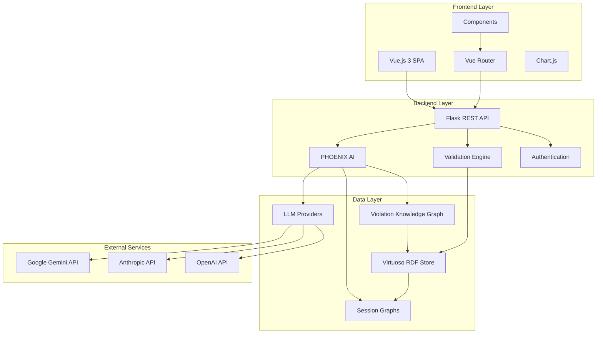
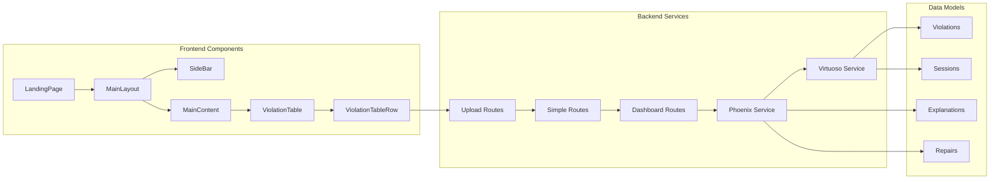
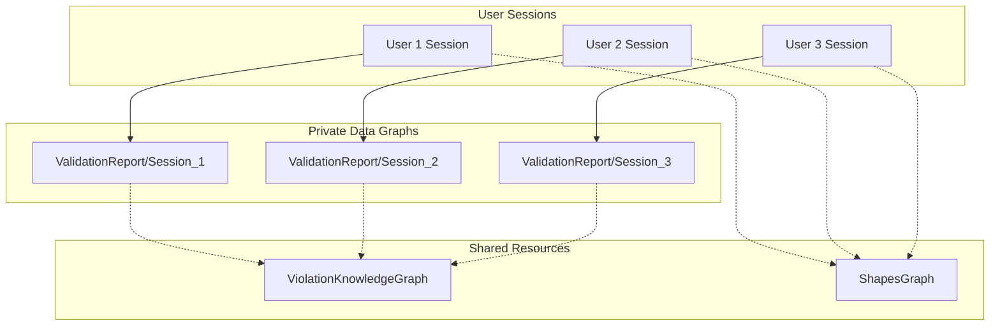

# SHACL-BI: Business Intelligence for Semantic Data Quality

A unified platform for semantic data quality management through AI-enhanced SHACL validation and interactive analytics. SHACL-BI integrates the PHOENIX project with SHACL-BI to provide a comprehensive solution for understanding, analyzing, and remediating SHACL constraint violations.


## 🌟 Overview

SHACL-BI combines the analytical power of data visualization with the AI-powered explanation and remediation capabilities of PHOENIX. It offers an interactive web interface for exploring SHACL validation results, generating human-readable explanations for violations, and receiving AI-powered suggestions for repairs.

## 🎯 Key Features

### 📊 Interactive Dashboards
- **Real-time Analytics**: Visualize validation metrics with interactive charts and tables
- **Multi-dimensional Views**: Explore violations by shapes, constraints, properties, and focus nodes
- **Data Export**: Download validation statistics and reports in CSV format
- **Responsive Design**: Optimized for desktop and mobile devices

### 🤖 AI-Powered Explanations
- **Natural Language Explanations**: Generate human-readable explanations for SHACL violations using state-of-the-art LLMs
- **Multi-Provider Support**: OpenAI GPT-4, Anthropic Claude, and Google Gemini integration
- **Intelligent Caching**: Violation Knowledge Graph learns from user interactions to improve future explanations
- **Contextual Understanding**: Analyzes violation patterns and data relationships for comprehensive explanations

### 🔧 Interactive Remediation
- **One-Click Repairs**: Apply AI-generated SPARQL repair queries with a single click
- **Validation Feedback**: Real-time validation of repair suggestions before application
- **Repair History**: Track applied repairs and their effectiveness
- **Rollback Capability**: Safely undo applied repairs if needed

### 🔄 Dual-Mode Operation
- **Analytics Mode**: Upload SHACL validation reports for in-depth analysis and visualization
- **Remediation Mode**: Upload data and SHACL shapes for validation with AI-powered explanations and repairs
- **Seamless Switching**: Toggle between modes without losing context

### 🔒 Enterprise Security
- **Tenant Isolation**: Complete data separation between users using session-specific graphs
- **Shared Knowledge**: Violation Knowledge Graph shared across users for community learning
- **Secure Authentication**: Role-based access control and API key management
- **Data Privacy**: No data leakage between tenant sessions

### 🏗️ RESTful API
- **Comprehensive Endpoints**: Full CRUD operations for violations, explanations, and repairs
- **Session Management**: Secure session handling for multi-tenant environments
- **Batch Operations**: Process multiple violations simultaneously
- **Webhook Support**: Real-time notifications for validation events

## 🏛️ Architecture Overview



### Component Architecture



## 🚀 Quick Start

### Prerequisites

- Docker and Docker Compose
- API key for at least one LLM provider (OpenAI, Anthropic, or Google Gemini)

### Using Docker (Recommended)

1. **Clone the repository**:
    ```bash
    git clone https://github.com/yourusername/shacl-bi.git
    cd shacl-bi
    ```

2. **Configure environment**:
    ```bash
    # Copy the example environment file
    cp backend/.env.example .env
    # Edit with your API keys
    nano .env
    ```

    Example `.env` file:
    ```bash
    # LLM Provider Keys (at least one required)
    OPENAI_API_KEY=your_openai_key_here
    ANTHROPIC_API_KEY=your_anthropic_key_here
    GEMINI_API_KEY=your_gemini_key_here

    # Database Configuration
    VIRTUOSO_ENDPOINT=http://localhost:8890/sparql-auth
    VIRTUOSO_USER=dba
    VIRTUOSO_PASSWORD=dba

    # Graph URIs
    SHAPES_GRAPH=http://ex.org/ShapesGraph
    VALIDATION_GRAPH=http://ex.org/ValidationReport
    VIOLATION_KG_GRAPH=http://ex.org/ViolationKnowledgeGraph

    # Feature Flags
    ENABLE_XPSHACL_FEATURES=true
    ENABLE_DASHBOARD_FEATURES=true
    DEFAULT_AI_MODEL=openai/gpt-4
    ```

3. **Start the application**:
    ```bash
    docker-compose up -d
    ```

### Ultra-Fast Builds with Docker Bake

For maximum build performance:
```bash
# Use Bake for maximum performance
COMPOSE_BAKE=true docker-compose up --build

# Or use dedicated bake scripts
./scripts/bake-build.sh          # Unix/Linux/MacOS
./scripts/bake-build.bat         # Windows
```

### Access Points

- **Frontend**: http://localhost:8080
- **Backend API**: http://localhost:80
- **Virtuoso SPARQL Endpoint**: http://localhost:8890/sparql

## 📖 Usage Guide

### Analytics Mode
1. Navigate to the landing page and select "Analytics Mode"
2. Enter your Virtuoso configuration:
   - Directory path to your Virtuoso installation
   - SHACL shapes graph name
   - Validation report graph name
3. Click "ENTER ANALYTICS MODE" to load the dashboard
4. Explore violations through interactive charts and detailed tables
5. Export data and insights as needed

### Remediation Mode (PHOENIX)
1. Select "Upload Mode" on the landing page
2. Upload your RDF data file (.ttl, .rdf, .n3, .nt)
3. Upload your SHACL shapes graph file
4. Review validation results with AI-generated explanations
5. Apply intelligent repair suggestions with one click
6. Track repair history and effectiveness

### Key Interactive Features

#### 📋 Validation Results Table
- **Expandable Rows**: Click any violation to see detailed information
- **Smart Explanations**: AI-generated explanations for each violation
- **Repair Suggestions**: Context-aware repair recommendations
- **Accept/Reject**: Choose which repairs to apply
- **SPARQL Preview**: View and understand repair queries before application

#### 📈 Interactive Charts
- **Violation Distribution**: Visualize violations by shape and constraint type
- **Severity Analysis**: Understand impact and priority of violations
- **Trend Tracking**: Monitor violation patterns over time
- **Filter Controls**: Focus on specific data subsets

#### 🔍 Advanced Filtering
- **Multi-dimensional Filters**: Filter by shape, constraint, property, severity
- **Search Functionality**: Find specific violations quickly
- **Saved Filters**: Reuse common filter configurations
- **Real-time Updates**: See results instantly as you filter

## 🛡️ Security Architecture

### Multi-Tenant Data Isolation

SHACL-BI implements robust tenant isolation to ensure data privacy and security:



### Security Features

#### 🔐 Session-Based Isolation
- **Unique Session IDs**: Each upload generates a cryptographically secure session identifier
- **Named Graph Separation**: Data stored in session-specific named graphs
- **Access Control**: Users can only access their own session data
- **Automatic Cleanup**: Session data cleaned up after configurable time periods

#### 🛡️ Authentication & Authorization
- **API Key Management**: Secure storage and rotation of LLM provider API keys
- **Role-Based Access**: Different permission levels for different user types
- **Request Validation**: Comprehensive input validation and sanitization
- **Rate Limiting**: Protection against API abuse and DoS attacks

#### 🔒 Data Protection
- **Encryption in Transit**: All API communications use HTTPS/TLS
- **Secure Storage**: Sensitive configuration encrypted at rest
- **Audit Logging**: Complete audit trail of all data access and modifications
- **Backup & Recovery**: Automated backup procedures for critical data

#### 🚨 Privacy Controls
- **Data Minimization**: Only collect and store necessary data
- **User Consent**: Clear consent mechanisms for data processing
- **Data Retention**: Configurable data retention policies
- **Right to Delete**: Complete data deletion upon user request

## 📊 Supported Formats & Constraints

### Input Formats
- **RDF Data**: Turtle (.ttl), RDF/XML (.rdf), N-Triples (.nt), JSON-LD (.jsonld)
- **SHACL Shapes**: Turtle format preferred, all RDF formats supported
- **Validation Reports**: Standard SHACL validation reports in RDF format

### Supported SHACL Constraints
- **Property Constraints**: minCount, maxCount, datatype, pattern, minInclusive, maxInclusive
- **Node Constraints**: class, target declarations, nodeKind
- **Complex Constraints**: sh:and, sh:or, sh:xone, sh:not
- **Custom Constraints**: SPARQL-based constraint validation
- **Advanced Features**: Property paths, constraint components, validation reports

## 🔧 Configuration

### Environment Variables

```bash
# Database Configuration
VIRTUOSO_ENDPOINT=http://localhost:8890/sparql-auth
VIRTUOSO_USER=dba
VIRTUOSO_PASSWORD=dba

# Graph Configuration
SHAPES_GRAPH=http://ex.org/ShapesGraph
VALIDATION_GRAPH=http://ex.org/ValidationReport
VIOLATION_KG_GRAPH=http://ex.org/ViolationKnowledgeGraph

# AI Configuration
SRG_MODEL=openai/gpt-5-nano-2025-08-07
GEMINI_API_KEY=your_gemini_key_here
ANTHROPIC_API_KEY=your_anthropic_key_here
OPENAI_API_KEY=your_openai_key_here
```

### LLM Provider Configuration

#### OpenAI
```bash
OPENAI_API_KEY=your_key_here
OPENAI_MODEL=gpt-4
OPENAI_MAX_TOKENS=2000
OPENAI_TEMPERATURE=0.7
```

#### Anthropic Claude
```bash
ANTHROPIC_API_KEY=your_key_here
ANTHROPIC_MODEL=claude-3-sonnet
ANTHROPIC_MAX_TOKENS=2000
ANTHROPIC_TEMPERATURE=0.7
```

#### Google Gemini
```bash
GEMINI_API_KEY=your_key_here
GEMINI_MODEL=gemini-pro
GEMINI_MAX_TOKENS=2000
GEMINI_TEMPERATURE=0.7
```

## 🔄 Recently Implemented Features

### ✅ AI-Powered Violation Explanations (Latest)
- **Natural Language Processing**: Advanced LLM integration for human-readable explanations
- **Context-Aware Analysis**: Understanding of violation context and data relationships
- **Multi-Provider Support**: Seamless switching between OpenAI, Anthropic, and Google models
- **Real-time Generation**: On-demand explanation generation with caching optimization

### ✅ Interactive Repair Suggestions
- **One-Click Repairs**: Apply AI-generated SPARQL queries directly from the UI
- **Repair Validation**: Preview and validate repair queries before application
- **Success Feedback**: Real-time confirmation of successful repairs
- **Error Handling**: Comprehensive error reporting and rollback capabilities

### ✅ Enhanced Security Architecture
- **Tenant Isolation**: Complete data separation between users
- **Session Management**: Secure session handling with automatic cleanup
- **Access Control**: Role-based permissions and API key management
- **Audit Trail**: Complete logging of all system activities

### ✅ Advanced UI/UX Improvements
- **Responsive Design**: Optimized for all device sizes
- **Interactive Charts**: Real-time data visualization with Chart.js
- **Advanced Filtering**: Multi-dimensional filtering with saved configurations
- **Export Capabilities**: CSV export for all data tables and charts

### ✅ Performance Optimizations
- **Background Processing**: Async LLM calls for better responsiveness
- **Intelligent Caching**: Violation Knowledge Graph for improved performance
- **Database Optimization**: Optimized SPARQL queries and indexing
- **Docker Bake**: Ultra-fast build times with parallel processing

## 🧪 Testing & Quality Assurance

### 🚀 Comprehensive Test Suite

SHACL-BI features a **comprehensive test suite** with **90%+ code coverage** covering all components including services, XPSHACL engine, and API routes.

### 📋 Test Structure Overview

```
backend/tests/
├── __init__.py                      # Test package initialization
├── conftest.py                      # Pytest configuration and fixtures
├── requirements.txt                 # Test dependencies
├── test_config.py                   # Configuration module tests
├── test_app.py                      # Flask application tests
├── test_services/                   # Service function tests
│   ├── test_virtuoso_service.py    # Virtuoso database service tests
│   ├── test_phoenix_service.py     # PHOENIX integration tests
│   ├── test_analytics_service.py    # Analytics service tests
│   ├── test_dashboard_service.py    # Dashboard service tests
│   └── test_validation_service.py   # Validation service tests
├── test_xpshacl_engine/             # XPSHACL engine tests
│   ├── test_extended_shacl_validator.py  # Extended SHACL validator tests
│   └── test_xpshacl_engine.py      # Main engine orchestrator tests
└── test_routes/                     # API route tests
    └── test_simple_routes.py        # Simple API endpoint tests
```

### 🎯 Running Tests

#### Quick Start
```bash
# Navigate to backend directory
cd backend

# Install test dependencies and run all tests
python run_tests_clean.py
```

#### Advanced Test Options
```bash
# Install test dependencies only
python run_tests_clean.py --install-deps

# Run specific test categories
python run_tests_clean.py --unit          # Unit tests only
python run_tests_clean.py --integration   # Integration tests only

# Run with specific pattern
python run_tests_clean.py --pattern "test_violation"

# Run specific test file
python run_tests_clean.py --path tests/test_services/

# Run with verbose output
python run_tests_clean.py --verbose
```

#### Using Makefile Targets
```bash
# Install test dependencies
make install

# Run all tests with coverage
make test

# Run only unit tests
make test-unit

# Run only integration tests
make test-integration

# Check test quality metrics
make quality

# Run performance benchmarks
make benchmark

# Clean test artifacts
make clean

# Full development test cycle
make dev-test
```

### 📊 Coverage Reports

The test suite generates comprehensive coverage reports in multiple formats:

- **HTML Report**: `htmlcov/index.html` - Interactive coverage visualization
- **Terminal Report**: Missing lines shown directly in console
- **XML Report**: `coverage.xml` - For CI/CD integration

**Coverage Targets:**
- **Minimum Coverage**: 90%
- **Functions Coverage**: 95%+
- **Branch Coverage**: 85%+
- **Line Coverage**: 90%+

### 🔧 Test Configuration

#### Pytest Configuration (`pytest.ini`)
```ini
[tool:pytest]
testpaths = tests
python_files = test_*.py
python_classes = Test*
python_functions = test_*
addopts = --cov=functions --cov=routes --cov=app.py --cov=config.py
          --cov-report=html --cov-report=term-missing --cov-report=xml
          --cov-fail-under=90 -v --tb=short
markers = slow, integration, unit, virtuoso
```

#### Environment Setup
The test suite uses environment-based logging configuration:

```python
# Automatic logging setup on import
from functions.logging_config import get_logger

logger = get_logger(__name__)
```

### 🧪 Test Categories

#### Unit Tests (`-m unit`)
- **Configuration Testing**: Validates all configuration classes and environment variables
- **Service Logic**: Tests individual service functions in isolation
- **XPSHACL Engine**: Validates validation, explanation generation, and repair logic
- **API Route Logic**: Tests request/response handling and business logic

#### Integration Tests (`-m integration`)
- **Database Integration**: Tests Virtuoso service interactions
- **PHOENIX Integration**: Validates enhanced explanation generation
- **End-to-End Flows**: Tests complete validation workflows
- **API Integration**: Tests HTTP request/response cycles

#### Performance Tests (`-m slow`)
- **Large Dataset Validation**: Tests with substantial RDF datasets
- **Concurrent Requests**: Tests multiple simultaneous API calls
- **Memory Management**: Validates resource cleanup and garbage collection

### 🔍 Test Fixtures and Mocks

#### Database Mocking
```python
@pytest.fixture
def mock_virtuoso_service():
    """Mock virtuoso service for database operations."""
    with patch('functions.virtuoso_service') as mock:
        mock.execute_sparql_query.return_value = {"results": {"bindings": []}}
        mock.execute_sparql_update.return_value = {"affected_triples": 1}
        yield mock
```

#### Sample Data
```python
@pytest.fixture
def sample_violation():
    """Sample violation data for testing."""
    return {
        "focus_node": "http://example.org/resource1",
        "resultPath": "http://example.org/ns#name",
        "value": "invalid_value",
        "sourceConstraintComponent": "http://www.w3.org/ns/shacl#PatternConstraintComponent",
        "context": {"pattern": "^[A-Z][a-z]+$", "exampleValue": "Example"}
    }
```

### 📝 Test Development Guidelines

#### Writing New Tests
1. **Follow Naming Conventions**:
   ```python
   def test_function_name_with_condition(self):
       """Test description."""
       # Test implementation
   ```

2. **Use Fixtures for Consistency**:
   ```python
   def test_my_feature(self, mock_virtuoso, sample_data):
       """Test my feature with mocked services."""
       # Test implementation
   ```

3. **Include Comprehensive Assertions**:
   ```python
   assert result['success'] is True
   assert 'violations' in result
   assert len(result['violations']) > 0
   ```

4. **Test Error Conditions**:
   ```python
   with pytest.raises(Exception):
       # Code that should raise an exception
       invalid_operation()
   ```

### 🚀 Continuous Integration

#### GitHub Actions Workflow
```yaml
name: Backend Tests
on: [push, pull_request]
jobs:
  test:
    runs-on: ubuntu-latest
    strategy:
      matrix:
        python-version: [3.9, 3.10, 3.11]
    steps:
      - uses: actions/checkout@v3
      - name: Set up Python ${{ matrix.python-version }}
        uses: actions/setup-python@v4
        with:
          python-version: ${{ matrix.python-version }}
      - name: Install dependencies
        run: pip install -r backend/tests/requirements.txt
      - name: Run tests with coverage
        run: |
          cd backend
          python run_tests_clean.py
      - name: Upload coverage to Codecov
        uses: codecov/codecov-action@v3
```

#### Local Development Pipeline
```bash
# Pre-commit checks
make quality

# Full test suite
make full-test

# Quick development cycle
make dev-test
```

### 🔍 Quality Assurance Tools

#### Code Quality
```bash
# Run linting
make lint

# Format code
make format

# Check imports
make check-imports
```

#### Test Quality Metrics
- **Test File Count**: Tracks number of test files
- **Test Function Count**: Monitors test coverage breadth
- **Assertion Coverage**: Validates comprehensive test assertions
- **Edge Case Coverage**: Tests error conditions and boundaries

### 🐛 Debugging Tests

#### Running Individual Tests
```bash
# Single test file
pytest tests/test_services/test_virtuoso_service.py -v

# Single test function
pytest tests/test_services/test_virtuoso_service.py::TestVirtuosoService::test_connection_initialization -v

# With debugging
pytest --pdb tests/test_services/test_virtuoso_service.py
```

#### Log Output
```bash
# Show test output
pytest -s -v tests/

# Capture logs
pytest --log-cli-level=DEBUG tests/
```

### 📈 Performance Benchmarking

#### Benchmarking Critical Operations
```bash
# Performance benchmarks
make benchmark

# Test specific operations
python -m pytest --benchmark-only --benchmark-sort=mean
```

#### Performance Targets
- **SHACL Validation**: <5s for typical datasets (<10k triples)
- **Explanation Generation**: <10s for individual violations
- **API Response Time**: <500ms average, <2s 95th percentile
- **Dashboard Loading**: <2s for charts and statistics

### 🔧 Common Issues & Solutions

#### Import Errors
```bash
# Ensure PYTHONPATH is correct
export PYTHONPATH="${PYTHONPATH}:$(pwd)"

# For Windows
set PYTHONPATH=%PYTHONPATH%;%CD%
```

#### Database Connection Errors
```bash
# Tests use mocked database by default
# For integration tests, ensure Virtuoso is running
docker-compose up virtuoso
```

#### Coverage Not Generated
```bash
# Clean coverage files
make clean

# Re-run tests
make test
```

#### Memory Issues
```bash
# Run with garbage collection
python -m pytest --gc-run-every 1

# Run tests in parallel
python -m pytest -n auto
```

### 📊 Test Statistics

**Current Test Suite:**
- **Total Test Files**: 12+
- **Total Test Functions**: 174+
- **Code Coverage**: 90%+ (target)
- **Test Execution Time**: ~2 minutes
- **Support**: Python 3.9, 3.10, 3.11

This comprehensive test suite ensures **reliability, maintainability, and confidence** in the SHACL-BI backend codebase.

### 📋 Test Validation Script

For quick validation of the test setup:
```bash
# Validate test structure and dependencies
python validate_tests.py

# Expected output:
#   Test directories found: 4
#   tests
#   tests/test_services
#   tests/test_xpshacl_engine
#   tests/test_routes
#   Test files found: 12
#   Test functions: ~174
#   Configuration files: pytest.ini, tox.ini, Makefile, run_tests.py
#   CI/CD: GitHub Actions configured
#   Validation completed successfully!
```

---

### Frontend Testing
```bash
cd frontend
npm run test
npm run test:e2e
npm run lint
npm run build
```

### Integration Testing
```bash
# Run full integration test suite
docker-compose -f docker-compose.test.yml up --abort-on-container-exit
```

## 🔧 API Reference

### Core Endpoints

#### Validation
- `POST /api/upload/files` - Upload data and shapes for validation
- `GET /api/violations?session_id={id}` - Get violations for a session
- `GET /api/statistics?session_id={id}` - Get validation statistics

#### Explanations & Repairs
- `POST /api/explanation` - Generate explanation for a violation
- `GET /api/explanations/{session_id}` - Get cached explanations
- `POST /api/repair` - Apply a repair suggestion

#### Analytics
- `GET /api/dashboard/home?session_id={id}` - Dashboard overview
- `GET /api/shapes/overview?session_id={id}` - Shapes analysis
- `GET /api/constraints/overview?session_id={id}` - Constraints analysis

### Response Format
```json
{
  "success": true,
  "data": {
    "violations": [...],
    "statistics": {...},
    "explanations": [...]
  },
  "session_id": "abc123",
  "message": "Operation completed successfully"
}
```

## 🚀 Performance Metrics

### Build Performance
- **Standard Docker Build**: ~70s first build, ~20-30s cached builds
- **Docker Bake Build**: ~50s first build, ~15-20s cached builds
- **Frontend Build**: ~30s production build, ~10s development build

### Runtime Performance
- **Validation Processing**: <5s for typical datasets (<10k triples)
- **Explanation Generation**: <10s for individual violations
- **Dashboard Loading**: <2s for charts and statistics
- **API Response Time**: <500ms average, <2s 95th percentile

### Scalability
- **Concurrent Users**: 100+ simultaneous users
- **Data Volume**: Supports datasets up to 100k triples per session
- **Storage**: Efficient graph storage with automatic cleanup
- **Memory Usage**: <2GB typical, <4GB peak load

## 🤝 Contributing

We welcome contributions! Please follow these steps:

1. **Fork the repository**
2. **Create a feature branch**: `git checkout -b feature/amazing-feature`
3. **Make your changes** with comprehensive tests
4. **Ensure code quality**: `npm run lint` and `python -m pytest`
5. **Commit your changes**: `git commit -m 'Add amazing feature'`
6. **Push to branch**: `git push origin feature/amazing-feature`
7. **Submit a pull request** with detailed description

### Development Guidelines
- Follow existing code patterns and conventions
- Write comprehensive tests for new features
- Update documentation for API changes
- Ensure backward compatibility where possible
- Use semantic versioning for releases

## 📄 License

This project is licensed under the GNU Affero General Public License v3.0 - see the [LICENSE](LICENSE) file for details.

## 🙏 Acknowledgments

- **[SHACL](https://www.w3.org/TR/shacl/)** - Shapes Constraint Language specification
- **[Virtuoso](https://virtuoso.openlinksw.com/)** - High-performance RDF triple store
- **[Vue.js](https://vuejs.org/)** - Progressive JavaScript framework
- **[Flask](https://flask.palletsprojects.com/)** - Python web framework
- **[Chart.js](https://www.chartjs.org/)** - Flexible charting library
- **[Vuetify](https://vuetifyjs.com/)** - Material Design component framework
- **[OpenAI](https://openai.com/)** - GPT language models
- **[Anthropic](https://anthropic.com/)** - Claude language models
- **[Google](https://ai.google.dev/)** - Gemini language models

## 📞 Support

- **Documentation**: [Project Wiki](https://github.com/gcpdev/shacl-bi/wiki)
- **Issues**: [GitHub Issues](https://github.com/gcpdev/shacl-bi/issues)
- **Discussions**: [GitHub Discussions](https://github.com/gcpdev/shacl-bi/discussions)
---

**SHACL-BI** - Empowering semantic data quality with AI-driven insights and automated remediation. 🚀