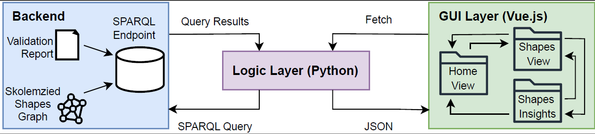

# SHACL-BI: Business Intelligence for Semantic Data Quality

A unified platform for semantic data quality management through AI-enhanced SHACL validation and interactive analytics. SHACL-BI integrates the PHOENIX project with SHACL Dashboard to provide a comprehensive solution for understanding, analyzing, and remediating SHACL constraint violations.


## Overview

SHACL-BI combines the analytical power of SHACL Dashboard with the AI-powered explanation and remediation capabilities of PHOENIX. It offers an interactive web interface for exploring SHACL validation results, generating human-readable explanations for violations, and receiving AI-powered suggestions for repairs.

## Key Features

- **Interactive Dashboards**: Visualize validation metrics with charts and tables.
- **AI-Powered Explanations**: Generate human-readable explanations for SHACL violations using Large Language Models (LLMs).
- **Interactive Remediation**: Receive AI-powered suggestions for repairing violations and apply them with a single click.
- **Dual-Mode Operation**:
    - **Analytics Mode**: Upload a SHACL validation report for in-depth analysis and visualization (classic SHACL Dashboard functionality).
    - **Remediation Mode**: Upload your data and SHACL shapes to perform validation and receive AI-powered explanations and repair suggestions (PHOENIX functionality).
- **RESTful API**: Access all validation data and AI-powered features programmatically.
- **Violation Knowledge Graph**: Learn from user interactions to improve future repair suggestions.
- **Multi-Provider LLM Support**: OpenAI, Anthropic, and Google Gemini integration.

## Architecture

SHACL-BI follows a client-server architecture:

- **Frontend**: Vue.js 3 single-page application with Vuetify and Chart.js.
- **Backend**: Flask RESTful API connecting to a Virtuoso database and LLM providers.
- **Database**: Virtuoso RDF triple store for storing shapes, data, validation reports, and the violation knowledge graph.



## Quick Start

### Prerequisites

- Docker and Docker Compose
- An API key for an LLM provider (OpenAI, Anthropic, or Gemini)

### Using Docker (Recommended)

1.  Clone the repository:
    ```bash
    git clone https://github.com/yourusername/shacl-bi.git
    cd shacl-bi
    ```
2.  Create a `.env` file in the root directory with your LLM API key:
    ```bash
    # Copy the example environment file
    cp backend/.env.example .env
    # Edit with your API keys
    nano .env
    ```

    Example `.env` file:
    ```
    # LLM Provider Keys (at least one required)
    OPENAI_API_KEY=your_openai_key_here
    ANTHROPIC_API_KEY=your_anthropic_key_here
    GEMINI_API_KEY=your_gemini_key_here

    # Default Model (optional)
    DEFAULT_AI_MODEL=openai/gpt-4

    # Application Settings
    FLASK_ENV=production
    ENABLE_XPSHACL_FEATURES=true
    ENABLE_DASHBOARD_FEATURES=true
    ```
3.  Run Docker Compose:
    ```bash
    docker-compose up -d
    ```

The application will be available at:
- **Frontend**: http://localhost:8080
- **Backend API**: http://localhost:80
- **Virtuoso SPARQL Endpoint**: http://localhost:8890/sparql

### Manual Installation

For development or custom deployments:

#### Backend Setup
```bash
cd backend
python -m venv venv
source venv/bin/activate  # On Windows: venv\Scripts\activate
pip install -r requirements.txt
cp .env.example .env  # Edit with your configuration
python app.py
```

#### Frontend Setup
```bash
cd frontend
npm install
npm run dev
```

## Usage

SHACL-BI offers two modes of operation:

### 1. Analytics Mode (SHACL Dashboard)
- Upload your SHACL validation report directly to the Virtuoso database
- Use the dashboard to analyze the validation results with interactive charts and tables
- Deep dive into specific shapes and constraint violations
- Export validation statistics and reports

### 2. Remediation Mode (PHOENIX)
- Select "PHOENIX Mode" on the landing page
- Upload your data graph and SHACL shapes graph (or use the sample data)
- The backend performs validation and loads results into the database
- Explore validation results with AI-powered explanations and repair suggestions
- Apply fixes interactively with one-click repair functionality
- Learn from user interactions to improve future suggestions

## Supported Formats

### Input Formats
- **RDF Data**: Turtle (.ttl), RDF/XML (.rdf), N-Triples (.nt), JSON-LD (.jsonld)
- **SHACL Shapes**: Turtle format preferred
- **Validation Reports**: SHACL validation reports in RDF format

### Supported SHACL Constraints
- Property constraints (minCount, maxCount, datatype, pattern, etc.)
- Node constraints (class, target declarations)
- Complex constraints with custom SPARQL queries
- Advanced constraints (sh:and, sh:or, sh:xone, sh:not)

## Configuration

### Environment Variables
```bash
# Database Configuration
VIRTUOSO_ENDPOINT=http://localhost:8890/sparql
VIRTUOSO_USER=dba
VIRTUOSO_PASSWORD=dba
SHAPES_GRAPH=http://ex.org/ShapesGraph
VALIDATION_GRAPH=http://ex.org/ValidationReport
VIOLATION_KG_GRAPH=http://ex.org/ViolationKnowledgeGraph

# AI Configuration
DEFAULT_AI_MODEL=openai/gpt-4
ENABLE_XPSHACL_FEATURES=true
ENABLE_DASHBOARD_FEATURES=true

# Application Settings
FLASK_ENV=production
FLASK_LOG_LEVEL=INFO
```

### LLM Provider Configuration
Configure any or all of the following providers in your `.env` file:

```bash
# OpenAI
OPENAI_API_KEY=your_key_here
# Supported models: gpt-4, gpt-3.5-turbo, etc.

# Anthropic Claude
ANTHROPIC_API_KEY=your_key_here
# Supported models: claude-3-opus, claude-3-sonnet, etc.

# Google Gemini
GEMINI_API_KEY=your_key_here
# Supported models: gemini-pro, gemini-pro-vision, etc.
```

## Project Structure

```plaintext
shacl-bi/
├── backend/                    # Flask backend server
│   ├── app.py                  # Main Flask application
│   ├── config.py               # Configuration management
│   ├── functions/              # Business logic modules
│   │   ├── xpshacl_engine/     # PHOENIX AI functionality
│   │   │   ├── xpshacl_engine.py       # Main LLM integration
│   │   │   ├── explanation_generator.py # AI explanation generation
│   │   │   ├── repair_engine.py         # Interactive remediation
│   │   │   ├── knowledge_graph.py       # Violation learning system
│   │   │   └── ...
│   │   ├── analytics_service.py         # Dashboard analytics
│   │   ├── virtuoso_service.py          # Database operations
│   │   └── ...
│   ├── routes/                 # API endpoint definitions
│   ├── evaluation/             # Evaluation datasets and metrics
│   └── requirements.txt        # Python dependencies
├── frontend/                   # Vue.js frontend application
│   ├── src/                    # Vue source files
│   ├── public/                 # Static assets
│   ├── dist/                   # Build output
│   └── package.json            # Node.js dependencies
├── docs/                       # Documentation and research
│   └── images/                 # Screenshots and diagrams
├── initdb/                     # Database initialization scripts
├── virtuoso-init-scripts/      # Virtuoso setup scripts
├── docker-compose.yml          # Docker Compose configuration
├── CLAUDE.md                   # Project context and development guide
└── README.md                   # This file
```

## API Endpoints

### Core Endpoints
- `POST /api/validate` - Validate data against SHACL shapes
- `GET /api/violations` - Retrieve validation violations
- `GET /api/violations/{id}` - Get detailed violation information
- `POST /api/violations/{id}/repair` - Apply AI-suggested repair
- `GET /api/statistics` - Get validation statistics and analytics
- `GET /api/shapes` - List available SHACL shapes
- `GET /api/config` - Get current configuration
- `POST /api/config` - Update configuration

### Dashboard Endpoints
- `GET /api/dashboard/overview` - Dashboard overview data
- `GET /api/dashboard/shapes/{id}` - Shape-specific analytics
- `GET /api/dashboard/violations/trends` - Violation trends over time

## Development

### Setting Up Development Environment

1. **Clone and Install Dependencies**
   ```bash
   git clone https://github.com/yourusername/shacl-bi.git
   cd shacl-bi

   # Backend
   cd backend
   python -m venv venv
   source venv/bin/activate  # Windows: venv\Scripts\activate
   pip install -r requirements.txt

   # Frontend
   cd ../frontend
   npm install
   ```

2. **Configure Environment**
   ```bash
   cp backend/.env.example .env
   # Edit .env with your API keys and configuration
   ```

3. **Start Development Servers**
   ```bash
   # Terminal 1: Backend
   cd backend
   python app.py

   # Terminal 2: Frontend
   cd frontend
   npm run dev
   ```

### Running Tests
```bash
# Backend tests
cd backend
python -m pytest

# Frontend tests
cd frontend
npm run test
```

## Contributing

We welcome contributions! Please follow these guidelines:

1. **Fork the repository** and create a feature branch
2. **Follow the coding standards** defined in `CLAUDE.md`
3. **Write tests** for new functionality
4. **Update documentation** as needed
5. **Submit a pull request** with a clear description

### Development Guidelines
- **Python**: Follow PEP 8, use type hints, write comprehensive docstrings
- **JavaScript/TypeScript**: Use ESLint + Prettier, prefer TypeScript
- **Commits**: Use conventional commit messages
- **Testing**: Maintain test coverage above 80%

## Research and Academic Use

This project is part of ongoing research in semantic data quality management and human-AI collaboration. For academic use:

- **Citation**: [BibTeX format available in `docs/citation.bib`]
- **Research Paper**: "SHACL-BI: Business Intelligence for Semantic Data Quality Management through AI-Enhanced Validation and Interactive Analytics"
- **Datasets**: Sample datasets available in `data/` directory for testing and evaluation

## Troubleshooting

### Common Issues

**Virtuoso Connection Failed**
```bash
# Check Virtuoso container status
docker-compose ps virtuoso

# View Virtuoso logs
docker-compose logs virtuoso
```

**LLM API Errors**
- Verify API keys in `.env` file
- Check network connectivity
- Ensure sufficient API quotas

**Frontend Build Issues**
```bash
# Clear node modules and reinstall
rm -rf node_modules package-lock.json
npm install
```

### Getting Help
- **Issues**: Report bugs and feature requests on [GitHub Issues](https://github.com/yourusername/shacl-bi/issues)
- **Documentation**: See `docs/` directory for detailed guides
- **Discussions**: Join our [GitHub Discussions](https://github.com/yourusername/shacl-bi/discussions)

## License

This project is licensed under the GNU Affero General Public License v3.0 - see the [LICENSE](LICENSE) file for details.

## Acknowledgments

- **PHOENIX Project**: AI-powered SHACL validation framework
- **SHACL Dashboard**: Comprehensive visualization and analysis tool
- **OpenLink Virtuoso**: High-performance RDF triple store
- **rdflib and pyshacl**: Python libraries for RDF processing and SHACL validation